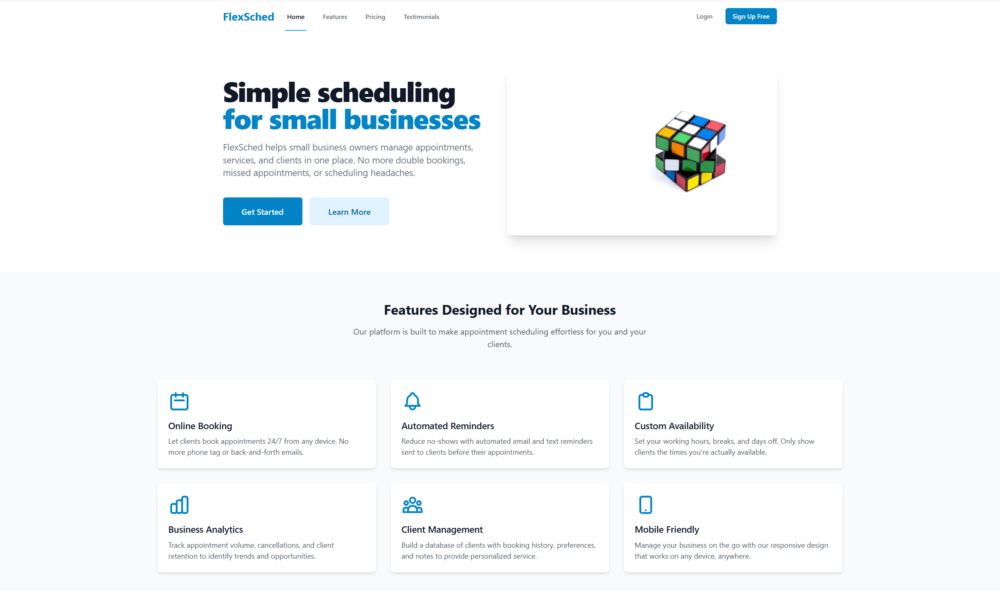
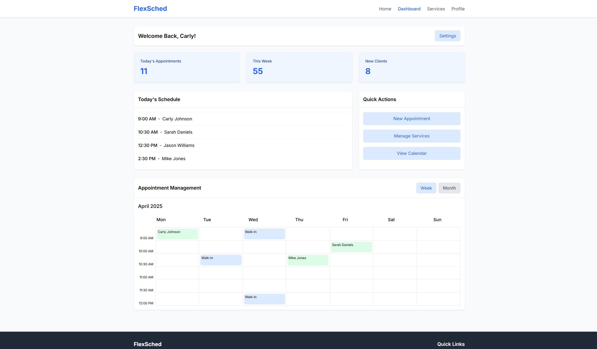

# Small Business Appointment Scheduler (Version 1)

## Project Overview: Appointment Scheduler (Frontend Only)

This document outlines my experience using AI (specifically Claude.ai) to help plan and build the **Version 1** of a responsive appointment scheduler web app using **HTML**, **TailwindCSS**, and **Alpine.js**.

---

##  1. My Experience Using AI for Planning

I used Claude.ai to assist in the **initial planning**, **layout design**, and **code generation** of the frontend. It helped me break the project into clear parts:

- Landing page (marketing + intro to the service)
- Appointment booking page for clients
- Business dashboard showing upcoming appointments
- Service and availability management page

Claude provided a structured approach, starting from semantic HTML layout all the way to Alpine.js interactivity, while maintaining accessibility and a professional UI style using TailwindCSS.

---

##  2. Effective Prompts I Discovered

I found that **specific, targeted prompts** generated much better results. Here are some of the most effective ones I used:

```text
"I’d like to refine the appointment booking. Could you:
1. Make the date picker and time fields required
2. Disable the submit button until all inputs are filled
3. Add comments explaining how Alpine.js handles the form state"

"Help me build a mobile-friendly navigation menu using Alpine.js with TailwindCSS transitions and a hamburger toggle."

"What color scheme and font pairings work best for a business-focused website that should feel calm, professional, and trustworthy?"
```

## 3. Challenges I Face & How I Overcame Them
| Challenge                              | How I Overcame It                                                             |
|----------------------------------------|-------------------------------------------------------------------------------|
| Overwhelming chunks of code from the AI | Asked for one page at a time and asked for explanations of code               |
| Inconsistent design between pages      | Created a shared style guide and asked AI to follow the same color/font rules |
| Understanding Alpine.js reactivity     | Asked for added code comments and simple use of `x-data`, `x-model`, `x-on`   |
| Responses were too generic             | Made my prompts more specific and broke them into numbered steps              |
| Unclear what Tailwind utility classes were doing| Used Tailwind docs and asked AI for plain-English explanations for each class |

## 4. Screenshots of Completed Front End
### Landing Page


### Client Booking Page


### Dashboard


### Business Services Page


## 5. What I Learned About Prompt Engineering
Here are some key takeaways about Prompt Engineering:

* Be clear about the outcome you want.
* Step-by-step instructions are ideal to use.
* Assist the AI assisting you.  If something doesn’t look right, ask for a revision. 
* Remain the leader and stay hands-on with the code, testing, and debugging.
* Prompt Engineering clarifies your thinking leading to more intentional design .

